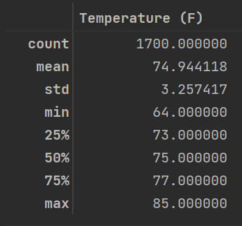
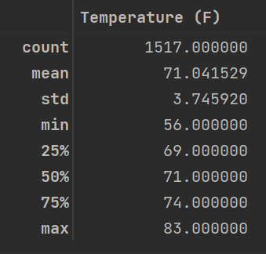
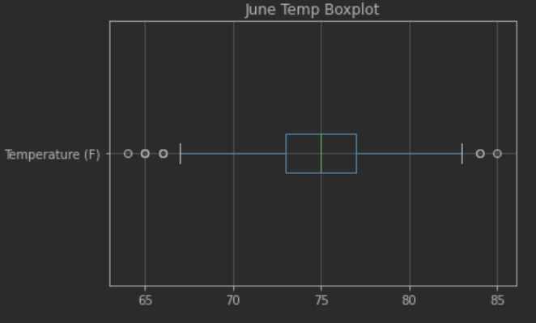
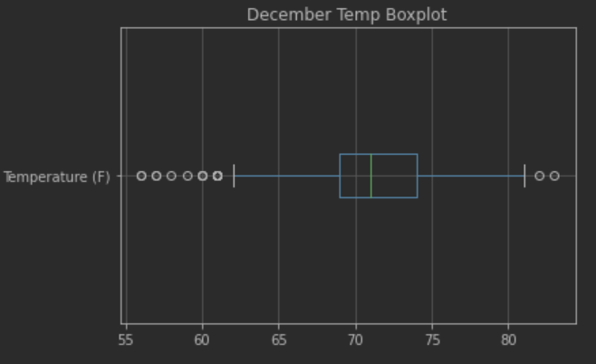

# Surfs up Challenge

## Objective
The objective of this project is to extract and analyze \
temperature trends in Oahu, Hawaii, in the months of June and December.
Analysis of the temperature trends will be used to determine the economic
viability of a year-round surf and ice cream shop. 

## Features and Data Sources
- Data Sources: `hawaii.sqlite`
- Programming Files: `SurfsUp_Challenge.ipynb`
- Software: `SQLAlchemy`, `SQLite`

## Data Description
Our data source, `hawaii.sqlite` is a database containing daily temperature
and precipitation measurements from weather stations around Hawaii.
The database also contains details on the locations of the weather stations.
Temperature and precipitation measurements are available from `January 1 2010` though
`August 23 2017`.

## Analysis
June and December temperatures in Hawaii:

| June                          | December                             |
|-------------------------------|--------------------------------------|
|  |  |

- There are `183` more temperature observations for June than December (data end date is August 23 2017)
- June mean temperatures are just shy of `4&deg;F` higher than December
- December temperatures are `more variable` than June, as seen in the higher standard deviation in December, at 3.75&deg;F
- December temperatures show `greater spread` between min and max temps, and, as shown in the below December Temp Boxplot, there are twice as many donwside outliers as June shows.
- The observed June temperatures have a slight negative or left skew
- The observed December temperatures have a slight positive or `right skew`

| June                           | December                       |
|--------------------------------|--------------------------------|
|  |  |

## Conclusions
Temperature data supports the idea a year-round ice cream surf shop in Hawaii. The mean temperature between the
two months is close, and the bulk of temperature measurements (top three quartiles) are close to each other as well.

## Considerations for further research
To more comfortably determine the economic viability of the shop, a few additional analyses should be done:
- Collect additional temperature data for both months, so that the sample size is more equal between them.
- Analyse temperature by station location to help determine the most amenable spot (with respect to weather) to launch the shop. 
- Collect demographic data on state residents and determine the most popular and/or accessible areas of the state for vacationers.
